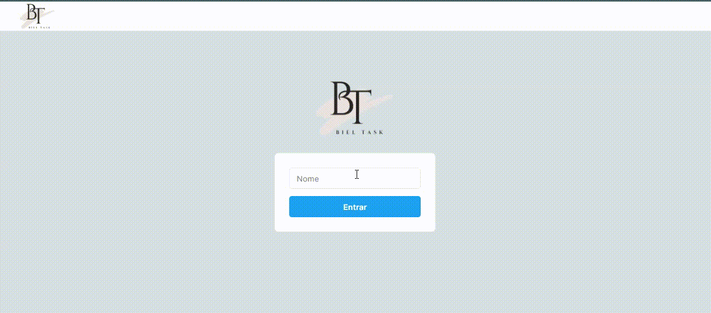
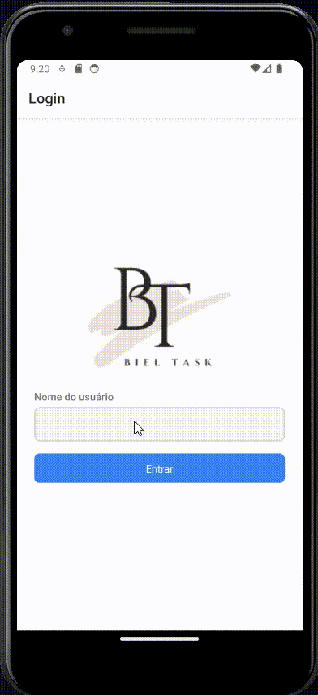

<h1 align="center">
 
  
 
</h1>
<h2>
Passos para rodar o projeto:
</h2>

  Aperte o botão "Code" acima para clonar o projeto para seu computador.  
  Após fazer o clone para seu computador, Recomendo usar a versão 16.14.0 do <a href="https://nodejs.org/en/" alt="Link para a instalaçao do Node" target="_blank">Node</a>, instale diretamente no site do Node ou altere usando o <a href="https://github.com/nvm-sh/nvm#installing-and-updating" alt="link para a instalação do NVM" target="_blank">Nvm</a> . 
  <h3>Como rodar o Back end:</h3>
  
1 - cd BackTaskList; 2 - npm i; 3 - npm run dev. Endereço -> http://localhost:3333/tasks

  <h3>Como rodar o Front end:</h3>
  
1 - cd FrontTaskList; 2 - npm i; 3 - npm run dev. Endereço -> http://localhost:5173

  <h3>Como rodar o Mobile:</h3>
  
1 - cd MobileTaskList; 2 - npm i; 3 - expo start. ATENÇÃO o IP para acessar a api estou usando um ip padrão dos emuladores Android, que é o "http://10.0.2.2:3333", caso queira acessar do seu dispostivo fisíco basta acessar a pasta services e o arquivo api.ts e no valor do baseUrl trocar para seu IP especifíco.

  

    
    

## Tecnologias

O projeto foi desenvolvido com as seguintes Tecnologias:

- React
- React Native
- Node com Express
- Sequelize (ORM)
- SQLITE (arquivo .db na raiz)
- Typescript
- Context API
- Chakra UI
- Native Base
- Apex Charts
- React Native Charts Community
- Axios
- UUID
- YUP
- FORMIK
- AsyncStorage para Mobile e SessionStorage para Web para persistir o Nome do usuário

---

Feito por Gabriel Freire, entre em contato pelo Linkedin --> <a href="https://www.linkedin.com/in/gabrielcfreire/">gabrielcfreire</a>
